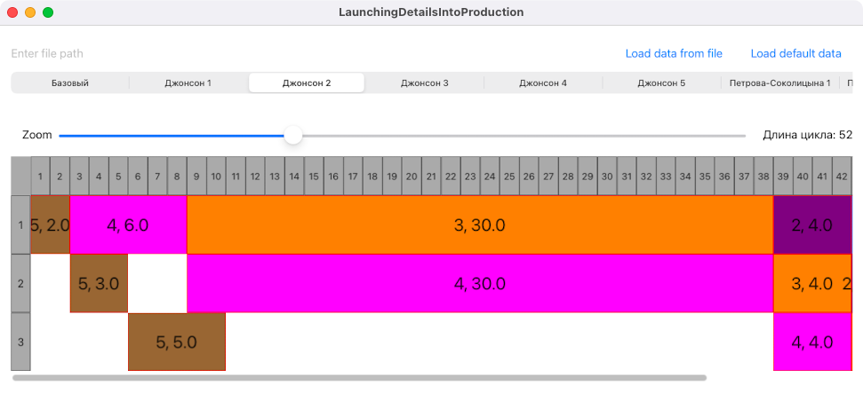
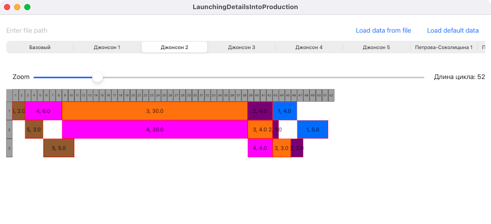
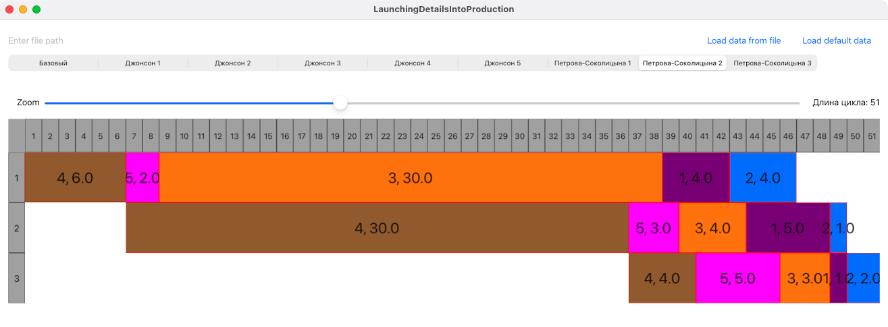

LaunchingDetailsIntoProduction
=====
The task of lauching details into production. It's using Johnson's and PetrovSokolycin's algorithms

## Features
- SwiftUI app
- Supports macOS (Mac Catalyst)
- Custom layout UICollectionView (Gantt layout)
- Zoom collection view layout for wide task line
- Load tasks from file

## Some screenshots

